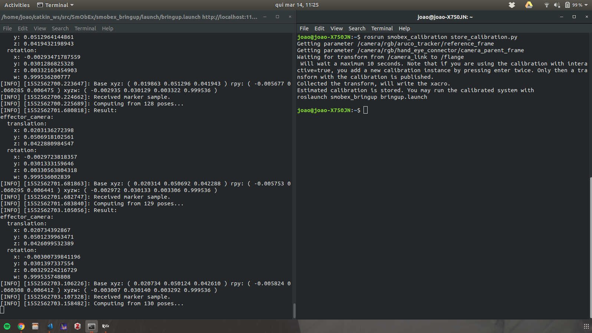
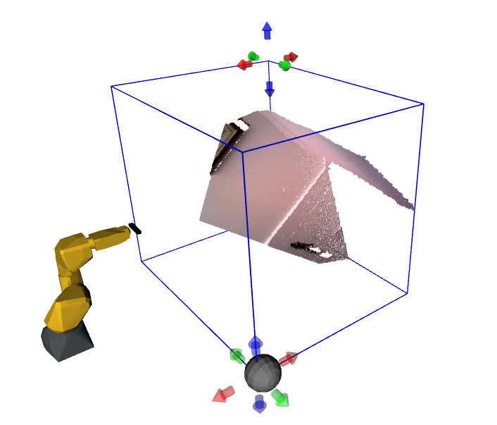
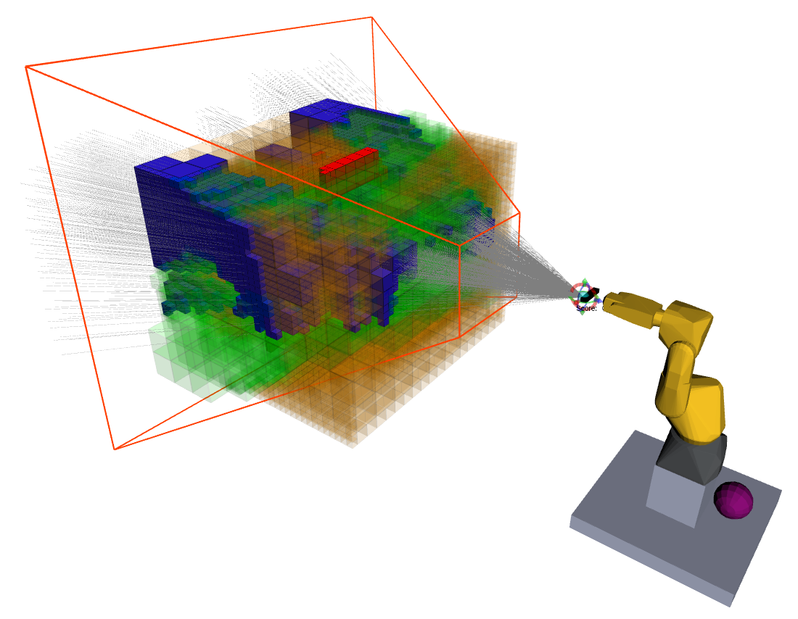

# SmObEx: Smart Object Exploration

Mechanical Engineering Masters Thesis in the field of Robotics.

The end goal of this dissertation was to develop an autonomous exploration robot that is capable of choosing the Next Best View which reveals the most amount of information about a given volume.

The exploration solution is based on a robotic manipulator, a RGB-D sensor and ROS. The manipulator provides movement while the sensor evaluates the scene in its Field of View. Using an OcTree implementation to reconstruct the environment, the portions of the defined exploration volume where no information has been gathered yet are segmented. This segmentation (or clustering) will help on the pose sampling operation in the sense that all generated poses are plausible. Ray casting is performed, either based on the sensor's resolution or the characteristics of the unknown scene, to assess the pose quality. The pose that is estimated to provide the evaluation of the highest amount of unknown space is the one chosen to be visited next, i.e., the Next Best View. The exploration reaches its end when all the unknown voxels have been evaluated or, those who were not, are not possible to be measured by any reachable pose.

The solution provided is, not only, adaptable to changes in the environment during the exploration, but also, portable to other manipualtors rather than the one used in the development.

## Released Content

- [Dissertation](http://hdl.handle.net/10773/27683)
- [Article]() _Coming Soon_
- [Video Playlist](https://www.youtube.com/playlist?list=PLlFdlPPJjdmmCzNEbp_u2mB5nFM9WHmFo)

## Dissertation title

_Smart object exploration by robotic manipulator_

Department of Mechanical Engineering (DEM), University of Aveiro (UA)

[LAR: Laboratory of Automation and Robotics](http://lars.mec.ua.pt/)

2019

## Advisor

Miguel Riem de Oliveira [GitHub](https://github.com/miguelriemoliveira/)

DEM, UA

Aveiro, Portugal

## Co-Advisor

Rafael Arrais [GitHub](https://github.com/rarrais)

INESC TEC

Porto, Portugal

# Built with

## Hardware

- [Fanuc Robot M6iB/6S](https://www.robots.com/robots/fanuc-m-6ib-6s)
- [Asus Xtion PRO LIVE](https://www.asus.com/3D-Sensor/Xtion_PRO_LIVE/)

## Software

- [ROS Melodic](http://www.ros.org/)
  - [ROS Industrial](https://rosindustrial.org/)
- [MoveIt]()
  - MoveIt Visual Tools
  - MoveIt Ros Planning Interface
- [OpenNi 2](http://wiki.ros.org/openni2_launch/)
- [Octomap Server](http://wiki.ros.org/octomap_server)
- [FANUC Driver](http://wiki.ros.org/fanuc) (based on)
- [ARUCO / VISP Hand-Eye Calibration](https://github.com/jhu-lcsr/aruco_hand_eye)

  - [Aruco ROS](https://github.com/pal-robotics/aruco_ros)
  - [visp](https://github.com/lagadic/vision_visp)

- [Hector Models](https://github.com/tu-darmstadt-ros-pkg/hector_models)

- [Camera Calibraton](http://wiki.ros.org/camera_calibration/Tutorials/MonocularCalibration)

- [OctoMap tools](https://github.com/miguelriemoliveira/octomap_tools)

- [PCL ROS](http://wiki.ros.org/pcl)

# Installation Guide

After installing ROS Melodic, you will need to run the following commands:

```bash
cd ~/catkin_ws/src
sudo apt install ros-melodic-industrial-core
sudo apt-get install ros-melodic-ros-canopen
sudo apt install ros-melodic-openni2-launch
sudo apt install ros-melodic-octomap-server
sudo apt install ros-melodic-pcl-ros
sudo apt install ros-melodic-visp
git clone https://github.com/ros-industrial/fanuc.git
git clone https://github.com/pal-robotics/aruco_ros
git clone https://github.com/jhu-lcsr/aruco_hand_eye
git clone https://github.com/tu-darmstadt-ros-pkg/hector_models
git clone https://github.com/miguelriemoliveira/octomap_tools
cd ..
catkin_make
rospack profile
```
# Robot Simple Usage

Everything is based on [this tutorial](http://wiki.ros.org/fanuc/Tutorials/Running).

## Moving the joint with the interface

```
roslaunch fanuc_m6ib_support test_m6ib6s.launch
```

If the graphics aren't right, the solution is [on this issue](https://github.com/ros-visualization/rviz/issues/1249#issuecomment-403351217). So all you have to do is

```bash
export LC_NUMERIC="en_US.UTF-8"

roslaunch fanuc_m6ib_support test_m6ib6s.launch
```

## Moving the robot with the TP

Wire connect the robot to the machine.

Configure the pc IP accordingly to the robot, in this example: 192.168.0.200

On the TP, run rosstate

On the Linux machine, run (using the IP of your robot)

```bash
roslaunch fanuc_m6ib_support robot_state_visualize_m6ib6s.launch robot_ip:=192.168.0.230
```

## Moving the robot with MoveIt

Start the ros TPE program in auto mode.

In the terminal run (using the IP of your robot)

```bash
roslaunch fanuc_xtion_moveit_config moveit_planning_execution.launch sim:=false robot_ip:=192.168.0.230
```

# SmObEx Usage

## Intrinsic Calibration

The intrinsic calibration process was done following [this tutorial](http://wiki.ros.org/camera_calibration/Tutorials/MonocularCalibration).

```bash
roslaunch openni2_launch openni2.launch 

rosrun camera_calibration cameracalibrator.py image:=/camera/rgb/image_raw camera:=/camera/rgb --size 8x6 --square 0.105
```


## Extrinsic Calibration Mode

**_Video_**: [SmObEx - ROS aruco hand2eye extrinsic calibration](https://youtu.be/zZ-sPsrrcI0)

For the calibration do the following steps:

1. place the ArUco marker (on smobex_bringup/launch/bringup.launch put the correct marker id and size)

2. run ROSSTATE on the TP and then

```bash
roslaunch smobex_bringup bringup.launch config:=true calibration:=true
```


1. to store the calibration, open another terminal and run

```bash
rosrun smobex_calibration store_calibration.py
```
(thanks to @miguelriemoliveira for the source code).



**Note: verify if store_calibration.py as running permissions.**

## Define Space Mode

**_Video_**: [SmObEx - OctoMap mapping of selected volume of the world](https://youtu.be/pa0htI7LZPg)

```bash
roslaunch smobex_bringup bringup.launch config:=true define_vol:=true
```

In the end don't forget to click on the grey sphere to save the configuration and only then to run

```bash
rosrun smobex_bringup store_volume.py
```



## Manual Pose Evaluation

**_Video_**: [SmObEx - Manual mode exploration of a volume](https://youtu.be/ltMPFWkhAAE)

## Autonomous Exploration

**_Video_**: [SmObEx - Fully autonomous exploration](https://www.youtube.com/watch?v=gfenHzBJkGk&list=PLlFdlPPJjdmmCzNEbp_u2mB5nFM9WHmFo&index=6)

```bash
roslaunch smobex_bringup bringup.launch
```



Green: Free Voxels

Red: Occupied Voxels

Orange: Unknown Voxels

Blue: Voxels expected to be known with this pose

Red Wireframe: camera's frustum

Gray Lines: Rays used in raycasting

# Auxiliary Functionalities

## Recording mode

To record the point cloud run

```bash
roslaunch smobex_bringup record.launch
```

(You must change the saving path in the launch file)

If at any moment you desire to save the OctoMap run

```bash
rosnode kill /accumulatedpointcloud

rosrun octomap_server octomap_saver -f test.ot
```

To visualize the point cloud or the OctoMap run, respectively,

```bash
pcl_viewer auto_save.pcd

octovis test.ot
```

360 degree mapping of LAR files:

- [Octree](./files/test.bt)

- [Point Cloud](./files/auto_save.pcd)


## Record bagfile

```bash
roslaunch smobex_bringup record_bag.launch name:=file_name

roslaunch smobex_bringup bringup.launch
```

## Play bagfile

```bash
roslaunch smobex_bringup play_bag.launch file:=file_name

roslaunch smobex_bringup bringup.launch online:=false
```

## Simulating in Roboguide

Connect both Linux and Windows machines by ethernet cable.

In the Windows set the IPv4 as 192.168.0.233\. In the Linux as 192.168.0.230.

Start Roboguide and run the ROS TPE program.

Then run

```bash
roslaunch fanuc_xtion_moveit_config moveit_planning_execution.launch robot_ip:=192.168.0.233 use_bswap:=false sim:=false
```

and set with rqt_reconfigure

```xml
<param name="move_group/trajectory_execution/allowed_execution_duration_scaling" value="4.0" />
<param name="move_group/trajectory_execution/execution_duration_monitoring" value="false" />
```

## Offline (robot) Mode

```bash
roslaunch smobex_bringup bringup.launch online:=false
```


# Contributions

- [FANUC M6iB/6S Packages](https://github.com/ros-industrial/fanuc/pull/277)
- [Octomap Tools](https://github.com/miguelriemoliveira/octomap_tools)
