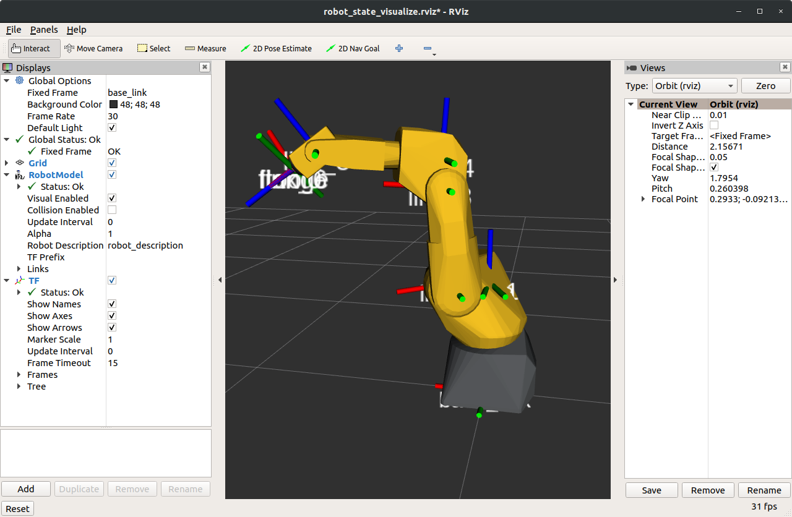
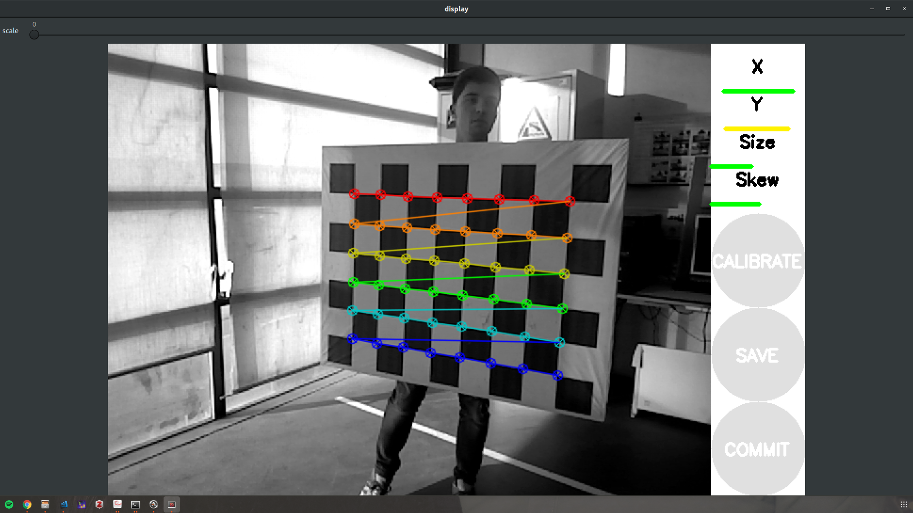
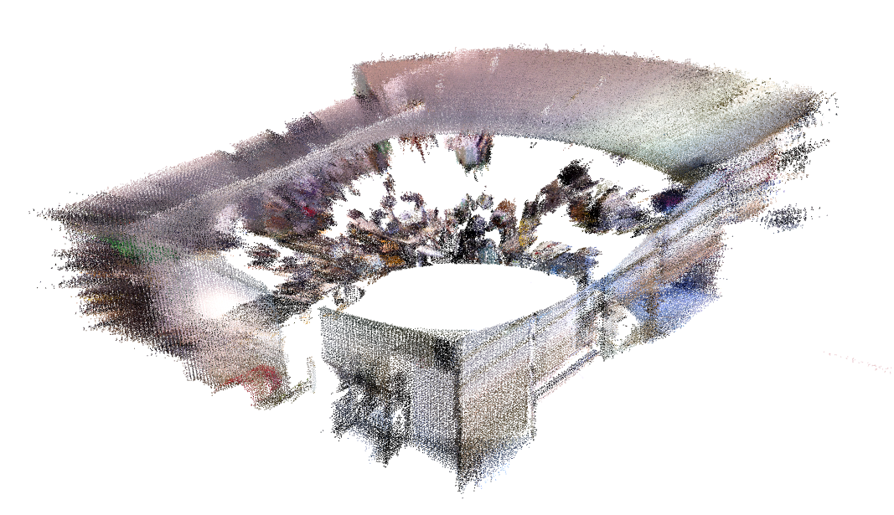
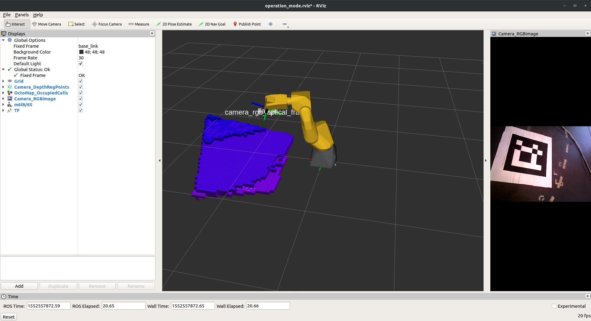

# SmObEx: Smart Object Exploration

My Mechanical Engineering Masters Thesis in the field of Robotics.

## Thesis title

*Smart object exploration by robotic manipulator*

Department of Mechanical Engineering (DEM), University of Aveiro (UA)

LAR: Laboratory of Automation and Robotics

2019

## Advisor

Miguel Riem de Oliveira [GitHub](https://github.com/miguelriemoliveira/)

DEM, UA

Aveiro, Portugal

## Co-Advisor

Rafael Arrais [GitHub](https://github.com/rarrais)

INESC TEC

Porto, Portugal

# Table of contents

- [Completed tasks](#completed-tasks)
  * [Week 10](#week-10)
  * [Week 11](#week-11)
  * [Week 12](#week-12)
  * [Week 13](#week-13)
  * [Week 14](#week-14)
  * [Week 15](#week-15)
- [Built with](#built-with)
  * [Hardware](#hardware)
  * [Software](#software)
- [Installation guides](#installation-guides)
  * [ROS Industrial and FANUC](#ros-industrial-and-fanuc)
  * [Aruco Hand Eye](#aruco-hand-eye)
- [See the robot](#see-the-robot)
  * [Moving the joint with the interface](#moving-the-joint-with-the-interface)
  * [Moving the robot with the TP](#moving-the-robot-with-the-tp)
  * [Moving the robot with MoveIt](#moving-the-robot-with-moveit)
- [Usage](#usage)
  * [Intrinsic Calibration](#intrinsic-calibration)
  * [Extrinsic Calibration Mode](#extrinsic-calibration-mode)
  * [Recording mode](#recording-mode)
    + [Results](#results)
  * [Operation mode](#operation-mode)
    + [Simulating in Roboguide](#simulating-in-roboguide)
    + [Offline (robot) Mode](#offline--robot--mode)
    + [Define Space Mode](#define-space-mode)
    + [Autonomous](#autonomous)

<small><i><a href='http://ecotrust-canada.github.io/markdown-toc/'>Table of contents generated with markdown-toc</a></i></small>

# Completed tasks

## Week 10

- [x] Retrieved Point Cloud from camera and visualized in Rviz
- [x] Single view OctoMap visualization in Rviz

## Week 11

- [x] Installed ROS Industrial on the Fanuc m6ib/6s
- [x] Connected ROS to the Fanuc
- [x] Updated the Fanuc package
     - [x] Updated the xacro file
     - [x] Updated the stl
     - [x] Create the support package 
     - [x] Create MoveIt "package"
- [x] Calibrate Xtion
     - [x] Configure Rviz with Xtion + Robot
     - [x] Obtained the tf from the end effector to the camera
     - [x] Implemented the tf automatically
     - [x] Get the best calibration possible (RGB intrinsic and camera extrinsic)

## Week 12

- [x] Accumulated Point Cloud to check calibration
- [x] Added mode to record Point Cloud and OctoMap
- [x] Restrict the volume to generate the model
- [x] Multiple view model of the world
- [x] Communicated with robot in Roboguide (other pc) 

## Week 13

- [x] Created node to generate multi view poses 

## Week 14

- [x] Updated FANUC controller software
- [x] Move using MoveIt

## Week 15

- [x] Visualization of the unknown space
- [x] Integrated the *octomap_bounding_box* node
- [ ] Evaluate each pose
      - [x] Evaluated one ray
      - [ ] Generated all camera rays for given pose

# Built with

## Hardware

- [Fanuc Robot M6iB/6S](https://www.robots.com/robots/fanuc-m-6ib-6s)
- [Asus Xtion PRO LIVE](https://www.asus.com/3D-Sensor/Xtion_PRO_LIVE/)

## Software

- [ROS Melodic](http://www.ros.org/)
- [OpenNi 2](http://wiki.ros.org/openni2_launch/)
- [Octomap Server](http://wiki.ros.org/octomap_server)
- [FANUC Driver](http://wiki.ros.org/fanuc) (based on)
- [ARUCO / VISP Hand-Eye Calibration](https://github.com/jhu-lcsr/aruco_hand_eye)
   * [Aruco ROS](https://github.com/pal-robotics/aruco_ros)
   * [visp](https://github.com/lagadic/vision_visp)  
- [Hector Models](https://github.com/tu-darmstadt-ros-pkg/hector_models)
- [Camera Calibraton](http://wiki.ros.org/camera_calibration/Tutorials/MonocularCalibration)
- [OctoMap tools](https://github.com/miguelriemoliveira/octomap_tools)
- [PCL ROS](http://wiki.ros.org/pcl)

# Installation guides

## ROS Industrial and FANUC

```bash
sudo apt-get install ros-melodic-industrial-core

sudo apt-get install ros-melodic-ros-canopen
```

At this stage, ROS Industrial is installed. Now the FANUC part.

```bash
git clone -b indigo https://github.com/ros-industrial/fanuc.git

rosdep install --from-paths src --ignore-src --rosdistro melodic
```

If you try to compile now it won't work, what you need to do is to follow [this issues' instructions](https://github.com/ros-industrial/fanuc/issues/241) and make changes on the ~/catkin_ws/src/fanuc directory run

```bash
find . -type f -exec sed -i 's/boost\:\:shared_ptr/std\:\:shared_ptr/g' {} \;
find . -type f -exec sed -i 's/boost\:\:const_pointer_cast/std\:\:const_pointer_cast/g' {} \;
```

This will change two lines in every fanuc_X_manipulator_ikfast_moveit_plugin.cpp so they now compile.

After this run `catkin_make` to try everything.

**Note: added my implementation to the m6ib6s.**

Already made a pull request with the M6iB/6S implementation. It has the same problem and solution described in the previous lines. 



## Aruco Hand Eye

```bash
cd ~/catkin_ws/src

git clone https://github.com/pal-robotics/aruco_ros

git clone https://github.com/lagadic/vision_visp

git clone https://github.com/jhu-lcsr/aruco_hand_eye

cd ..

catkin_make
```

# See the robot

Everything is based on [this tutorial](http://wiki.ros.org/fanuc/Tutorials/Running).

## Moving the joint with the interface

```
roslaunch fanuc_m6ib_support test_m6ib6s.launch
```

If the graphics aren't right, the solution is [on this issue](https://github.com/ros-visualization/rviz/issues/1249#issuecomment-403351217). So all you have to do is

```bash
export LC_NUMERIC="en_US.UTF-8"

roslaunch fanuc_m6ib_support test_m6ib6s.launch
```
## Moving the robot with the TP

Wire connect the robot to the machine.

Set the IP of the machine to 192.168.0.200

On the TP, run rosstate

On the Linux machine, run 

```bash
roslaunch fanuc_m6ib_support robot_state_visualize_m6ib6s.launch robot_ip:=192.168.0.230
```

## Moving the robot with MoveIt

Start the ros TPE program in auto mode.

In the terminal run 

```bash
roslaunch fanuc_xtion_moveit_config moveit_planning_execution.launch sim:=false robot_ip:=192.168.0.230
```

# Usage

## Intrinsic Calibration

The intrinsic calibration process was done following [this tutorial](http://wiki.ros.org/camera_calibration/Tutorials/MonocularCalibration).

```bash
roslaunch openni2_launch openni2.launch 

rosrun camera_calibration cameracalibrator.py image:=/camera/rgb/image_raw camera:=/camera/rgb --size 8x6 --square 0.105
```



## Extrinsic Calibration Mode

**_Video_**: [SmObEx - ROS aruco hand2eye extrinsic calibration](https://youtu.be/zZ-sPsrrcI0)

For the calibration do the following steps:

1. place the ArUco marker (on smobex_bringup/launch/bringup.launch put the correct marker id and size)

2. run 

```bash 
roslaunch smobex_bringup bringup.launch config:=true calibration:=true
```

3. to store the calibration, open another terminal and run 

```bash
rosrun smobex_calibration store_calibration.py
```

(thanks to @miguelriemoliveira for the source code).


**Note: verify if store_calibration.py as running permissions.**

## Recording mode

To record the point cloud run 

```bash
roslaunch smobex_bringup record.launch 
```

(You must change the saving path in the launch file)

If at any moment you desire to save the OctoMap run 

```bash
rosnode kill /accumulatedpointcloud

rosrun octomap_server octomap_saver -f test.ot
```

To visualize the point cloud or the OctoMap run, respectively, 

```bash
pcl_viewer auto_save.pcd

octovis test.ot
```

### Results

360 degree mapping of LAR files:

- [Octree](./files/test.bt)

- [Point Cloud](./files/auto_save.pcd)




## Operation mode

### Simulating in Roboguide

Connect both Linux and Windows machines by ethernet cable.

In the Windows set the IPv4 as 192.168.0.233. In the Linux as 192.168.0.230.

Start Roboguide and run the ROS TPE program.

Then run

```bash
roslaunch fanuc_xtion_moveit_config moveit_planning_execution.launch robot_ip:=192.168.0.233 use_bswap:=false sim:=false
```

and set with rqt_reconfigure

```xml
<param name="move_group/trajectory_execution/allowed_execution_duration_scaling" value="4.0" />
<param name="move_group/trajectory_execution/execution_duration_monitoring" value="false" />
```

### Offline (robot) Mode

```bash 
roslaunch smobex_bringup bringup.launch online:=false
```


### Define Space Mode

**_Video_**: [SmObEx - OctoMap mapping of selected volume of the world](https://youtu.be/pa0htI7LZPg)

```bash 
roslaunch smobex_bringup bringup.launch config:=true define_vol:=true
```

In the end don't forget to click on the grey sphere to save the configuration and only then to run

```bash
rosrun smobex_bringup store_volume.py
```


### Autonomous

1. run 

```bash 
roslaunch smobex_bringup bringup.launch
```

