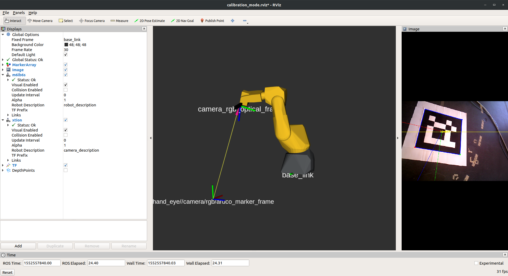

# SmObEx: Smart Object Exploration

My Mechanical Engineering Masters Thesis in the field of Robotis.

## Thesis title

*Smart object exploration by robotic manipulator*

Department of Mechanical Engineering (DEM), University of Aveiro (UA)

LAR: Laboratory of Automation and Robotics

2019

## Advisor

Miguel Riem de Oliveira [GitHub](https://github.com/miguelriemoliveira/)

DEM, UA

Aveiro, Portugal

## Co-Advisor

Rafael Arrais [GitHub](https://github.com/rarrais)

INESC TEC

Porto, Portugal

# Table of contents

- [Built with](#built-with)
  * [Hardware](#hardware)
- [Installation guides](#installation-guides)
  * [ROS Industrial and FANUC](#ros-industrial-and-fanuc)
  * [Aruco Hand Eye](#aruco-hand-eye)
- [See the robot](#see-the-robot)
  * [Moving the joint with the interface](#moving-the-joint-with-the-interface)
  * [Moving the robot with the TP](#moving-the-robot-with-the-tp)
  * [Moving the robot with MoveIt](#moving-the-robot-with-moveit)
- [Usage](#usage)
  * [Intrinsic Calibration](#intrinsic-calibration)
  * [Extrinsic Calibration Mode](#extrinsic-calibration-mode)
  * [Operation mode](#operation-mode)

<small><i><a href='http://ecotrust-canada.github.io/markdown-toc/'>Table of contents generated with markdown-toc</a></i></small>

# Completed tasks

- [x] Retrived Point Cloud from camera and visualized in Rviz
- [x] Single view OctoMap visualization in Rviz
- [x] Installed ROS Industrial on the Fanuc m6ib/6s
- [x] Connected ROS to the Fanuc
- [x] Updated the Fanuc package
     - [x] Updated the xacro file
     - [x] Updated the stl
     - [x] Create the support package 
     - [x] Create MoveIt "package"
- [ ] Move using MoveIt
- [x] Calibrate Xtion
     - [x] Configure Rviz with Xtion + Robot
     - [x] Obtained the tf from the end effector to the camera
     - [x] Implemented the tf automatically
     - [x] Get the best calibration possible (intrinsic and extrisic)
- [ ] Multiple view model of the world
- [ ] Restrict the volume to generate the model

# Built with

- [ROS Melodic](http://www.ros.org/)
- [OpenNi 2](http://wiki.ros.org/openni2_launch/)
- [Octomap Server](http://wiki.ros.org/octomap_server)
- [FANUC Driver](http://wiki.ros.org/fanuc) (based on)
- [ARUCO / VISP Hand-Eye Calibration](https://github.com/jhu-lcsr/aruco_hand_eye)
   * [Aruco ROS](https://github.com/pal-robotics/aruco_ros)
   * [visp](https://github.com/lagadic/vision_visp)  
- [Hector Models](https://github.com/tu-darmstadt-ros-pkg/hector_models)
- [Camera Calibraton](http://wiki.ros.org/camera_calibration/Tutorials/MonocularCalibration)

## Hardware

Fanuc Robot M6iB/6S

Asus Xtion PRO LIVE

# Installation guides

## ROS Industrial and FANUC

```bash
sudo apt-get install ros-melodic-industrial-core

sudo apt-get install ros-melodic-ros-canopen
```

Ah this stage, ROS Industrial is installed. Now the FANUC part.

```bash
git clone -b indigo https://github.com/ros-industrial/fanuc.git

rosdep install --from-paths src --ignore-src --rosdistro melodic
```

Now you must go to /src/fanuc and only leave the followin folders (where it's m6ib, it should be your robot model):

- fanuc
- fanuc_driver
- fanuc_m6ib_moveit_config
- fanuc_m6ib_moveit_plugins
- fanuc_m6ib_support
- fanuc_resources
- LICENSE
- readme.md

If you try to compile now it won't work, what you need to do is to follow [this issues' intructions](https://github.com/ros-industrial/fanuc/issues/241) and make changes on the fanuc_m6ib_moveit_plugins/m6ib_kinematics/src/fanuc_m6ib_manipulator_ikfast_moveit_plugin.cpp.

After this run `catkin_make` to try everything.

**Note: added my implementation to the m6ib6s.**


## Aruco Hand Eye

```bash
cd ~/catkin_ws/src

git clone https://github.com/pal-robotics/aruco_ros

git clone https://github.com/lagadic/vision_visp

git clone https://github.com/jhu-lcsr/aruco_hand_eye

cd ..

catkin_make
```

# See the robot

Everything is based on [this tutorial](http://wiki.ros.org/fanuc/Tutorials/Running).

## Moving the joint with the interface

```
roslaunch fanuc_m6ib_support test_m6ib6s.launch
```

If the graphics aren't right, the solution is [on this issue](https://github.com/ros-visualization/rviz/issues/1249#issuecomment-403351217). So all you have to do is

```bash
export LC_NUMERIC="en_US.UTF-8"

roslaunch fanuc_m6ib_support test_m6ib6s.launch
```
## Moving the robot with the TP

Wire connect the robot to the machine.

Set the IP of the machine to 192.168.0.200

On the TP, run rosstate

On the Linux machine, run 

```bash
roslaunch fanuc_m6ib_support robot_state_visualize_m6ib6s.launch robot_ip:=192.168.0.230
```

## Moving the robot with MoveIt

*Not yet working*

Start the ros TPE program inauto mode.

In the terminal run 

```bash
roslaunch fanuc_m6ib6s_moveit_config moveit_planning_execution.launch sim:=false robot_ip:=192.168.0.230
```

# Usage

## Intrinsic Calibration

The intrinsic calibration process was done following [this tutorial](http://wiki.ros.org/camera_calibration/Tutorials/MonocularCalibration).


## Extrinsic Calibration Mode

Video: [SmObEx - ROS aruco hand2eye extrinsic calibration](https://youtu.be/zZ-sPsrrcI0)

For the calibration do the following steps:

1. place the ArUco marker (on smobex_bringup/launch/bringup.launch put the correct marker id and size)

2. run 

```bash 
roslaunch smobex_bringup bringup.launch calibration:=true
```

If Rviz xtion Robot Description gives error state because of links from the robot, just press the Reset button. Don't know why this happens, but solves it...

3. to store the calibration, open another terminal and run 

```bash
rosrun smobex_calibration store_calibration.py
```

(thanks to @miguelriemoliveira for the source code).




**Note: verify if store_calibration.py as running permissions.**

## Operation mode

1. run 

```bash 
roslaunch smobex_bringup bringup.launch
```


